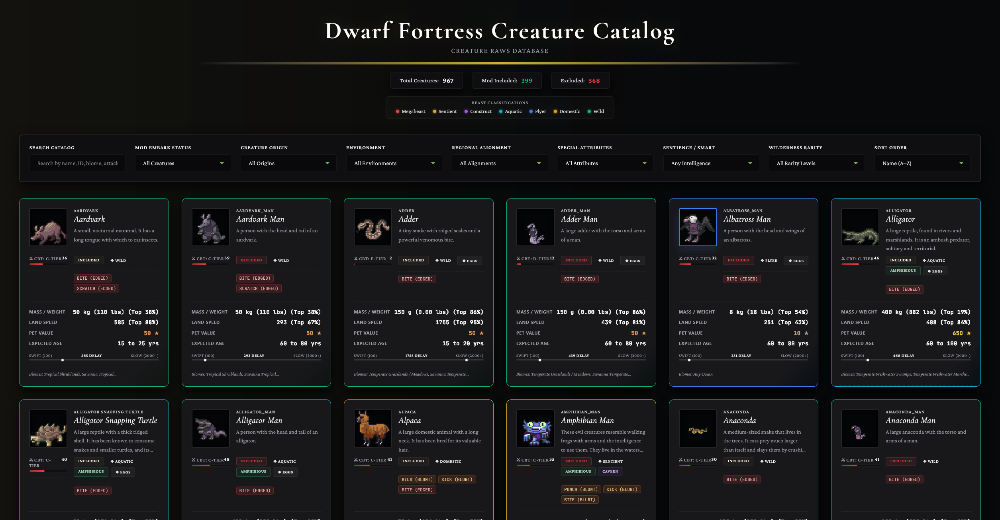
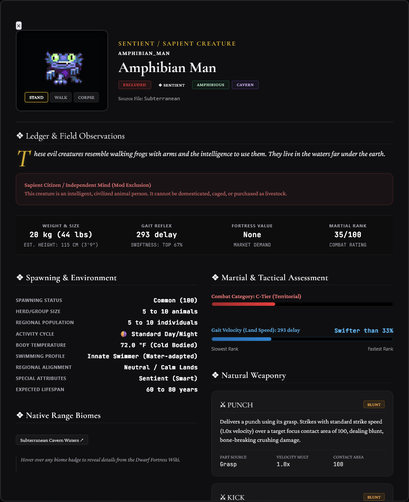
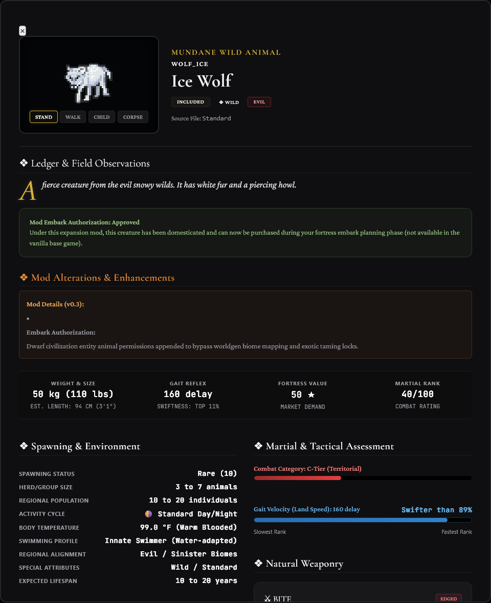
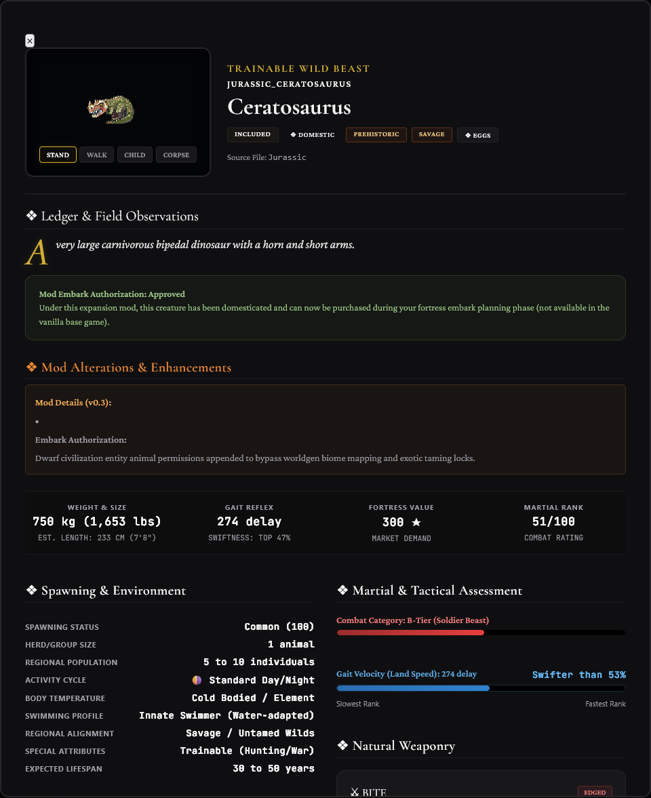
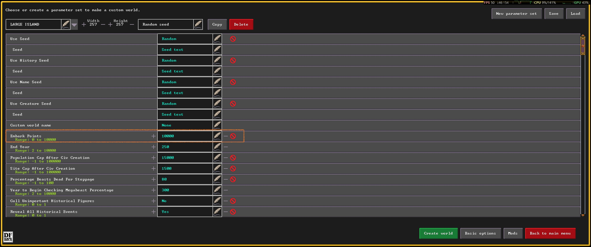

# Ultimate Embark Animals: All Native Creatures Embark

The base game of Dwarf Fortress restricts the starting embark screen to a small handful of standard domestic animals (dogs, cats, pigs, sheep, etc.). 

**Ultimate Embark Animals** compiles the vanilla creature raw files and appends the `[COMMON_DOMESTIC]`, `[TRAINABLE]`, and `[PET]` tags to **399 vanilla native creatures**, allowing you to start your fortress with a giant panda, a woolly mammoth, a cave crocodile, or a troop of macaques right from day one!

---

## 🔗 Key Links & Interactive Pokedex
* 🎮 **Steam Workshop Page:** [Ultimate Embark Animals on Steam](https://steamcommunity.com/sharedfiles/filedetails/?id=3751705029)
* 📖 **DF Pokedex Companion Bestiary:** [Dwarf Fortress Creature Catalog Website](https://telendrith.github.io/dwarf-fortress-creature-catalog/)

We host an interactive, searchable **DF Pokedex** companion website. It acts as an invaluable guide for both playing and mod planning:
* **Complete Searchable Catalog:** Search all 967 parsed vanilla creatures by name, ID, or custom attributes.
* **Triage Lists:** Filter included creatures (embark-ready) vs. excluded/cut creatures (with detailed reasons why they were filtered out).
* **Husbandry Reference:** Compare body weights (with percentiles), land speeds (gait delays), max age, biomes, and egg-laying metrics.
* **Combat Assessment:** View natural weapon strike speeds, contact areas, and damage forms for training war animals.

---

## 📸 Screenshots
Here is a preview of the **Dwarf Fortress Creature Catalog (DF Pokedex)** companion web app, showing the main catalog search and various examples of detailed creature entries in our bestiary:

| Catalog Homepage | Diverse Creature Details (Example 1) |
|---|---|
|  |  |
| **Diverse Creature Details (Example 2)** | **Diverse Creature Details (Example 3)** |
|  |  |

---

## 🌟 Mod Features

* **Complete Domestication:** Adds the `[COMMON_DOMESTIC]`, `[TRAINABLE]`, and `[PET]` tags to 399 vanilla creatures.
* **Exotic War Armies:** Every added creature can be trained for **War** or **Hunting** by your animal trainers, allowing you to protect your gates with war elephants, war pandas, or war dinosaurs.
* **Sanitized Exclusions:** Sapient creatures (like Elves, Goblins, Humans), borderline cavern citizens (Trolls, Gremlins, Troglodytes), night creatures, megabeasts (Dragons, Hydras), and technical vehicle entities (Wagons) are strictly excluded to keep gameplay balanced and lore-friendly.
* **Wild Yeti and Sasquatch Spawning:** Strips the mythical `[FANCIFUL]` tag from Yetis and Sasquatches, converting them into active spawning wild beasts in mountain, glacier, forest, and tundra biomes in your generated worlds while keeping them embark-ready.
* **Re-balanced Cave Dragons:** Reduces the exorbitant vanilla Cave Dragon cost from `10,000` to a viable `1,000` embark points so they are actually purchasable.
* **Amphibious Marine Overrides:** Strictly aquatic creatures (like Megalodon) remain aquatic and will suffocate on land. However, logical semi-aquatic prehistoric creatures (like Archelon giant turtles, sea scorpions, and placodonts) have been given the `[AMPHIBIOUS]` tag so they survive embarking on dry land and can crawl to water.

---

## 🗂 Organized Embark UI Layout
To eliminate list clutter on the embark screen, creatures are organized into three distinct blocks and sorted in ascending order of their purchase price:

1. **Mundane Wild Fauna:** Normal surface animals, starting from cheap birds and rabbits up to high-value grizzly bears and elephants.
2. **Cavern Dwellers:** Subterranean creatures, starting from cheap pests (Crundles, Fire Imps) up to deep cavern guardians (Cave Crocodiles, Cave Dragons).
3. **Prehistoric Giants:** Extinct species, starting from small ancient life (Dodos) up to massive beasts (T-Rex, Brachiosaurus, Mosasaurus).

> [!TIP]
> **Increase Embark Points in Worldgen:** Because large, powerful creatures are expensive, I ***seriously*** recommend increasing your default starting embark points in your worldgen settings if you plan to buy creatures that are expensive. Some creatures are very valuable and cost lots of embark points!
> 
> 

---

## 💾 Installation

### Option 1: Steam Workshop (Recommended)
1. Go to the [Steam Workshop Mod Page](https://steamcommunity.com/sharedfiles/filedetails/?id=3751705029).
2. Click **Subscribe**.
3. Launch Dwarf Fortress, generate a new world, click the **Mods** button, and move **Ultimate Embark Animals** to the active mod list!

### Option 2: Manual Installation
1. Clone or download this repository.
2. Copy the `ultimate_embark_animals/` directory.
3. Paste it into your Dwarf Fortress `mods/` directory:
   * **Steam:** `G:\SteamLibrary\steamapps\common\Dwarf Fortress\mods\`
   * **Classic/AppData:** `C:\Users\<YourUsername>\AppData\Roaming\Bay 12 Games\Dwarf Fortress\mods\`
4. Launch the game, click **Mods** on the world generation setup screen, move **Ultimate Embark Animals** to the active mod list, and generate a new world!

*Note: Like all Dwarf Fortress raw mods, this requires generating a new world to take effect.*

---

## 🧩 Compatibility
This mod uses modular `[SELECT_CREATURE]` and `[SELECT_ENTITY]` raw statements instead of replacing base game files. This makes it fully compatible with other mods, including total conversions, as long as they load after vanilla files.
